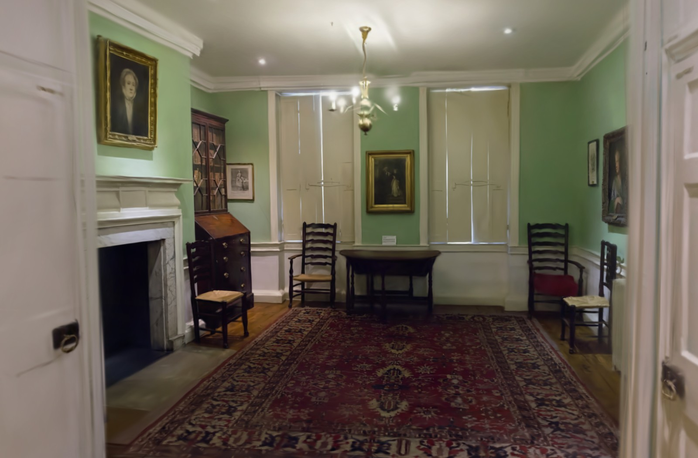
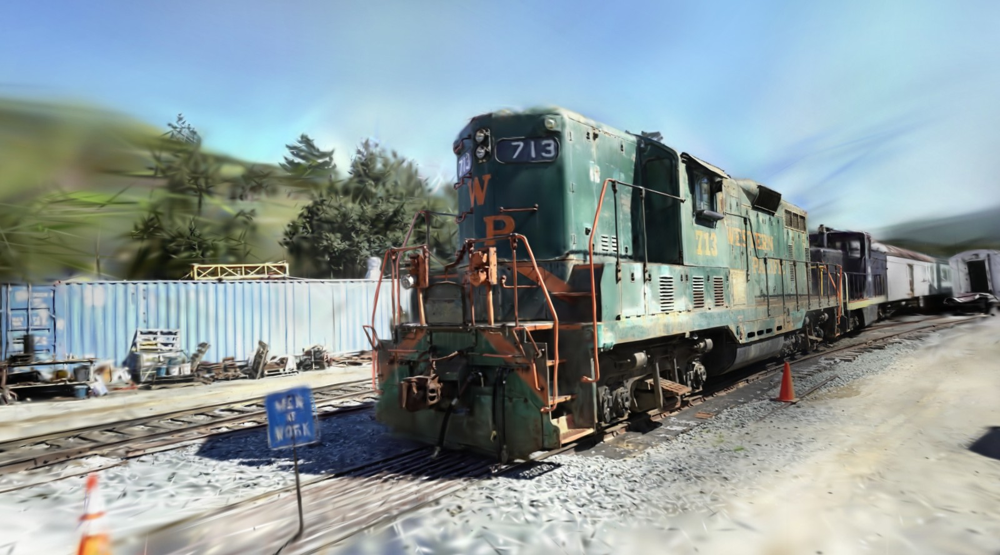
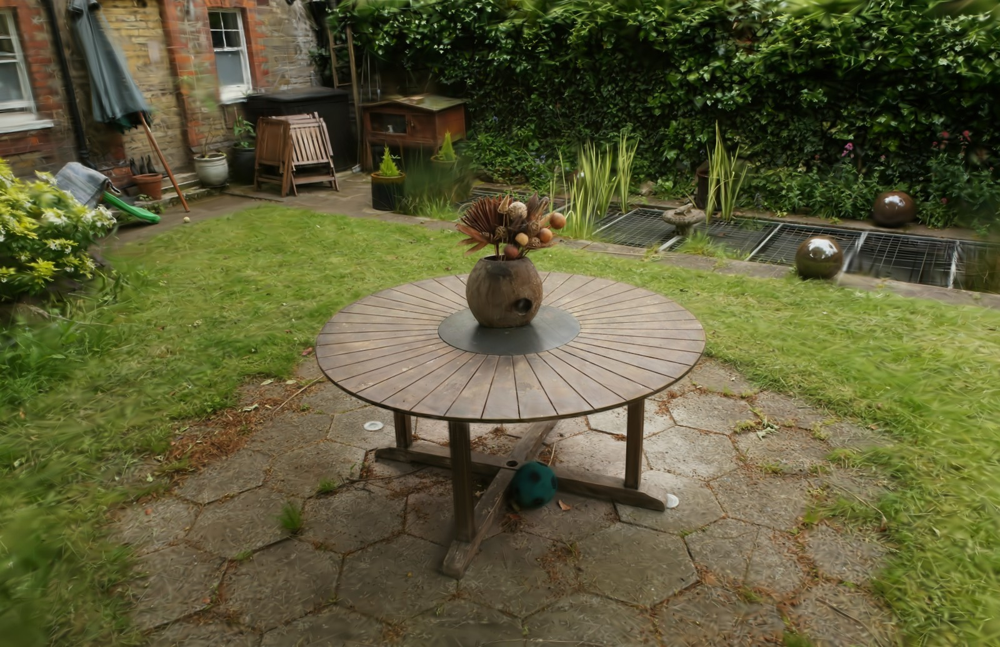

# 3D Gaussian Splatting





## Overview

- Implementation using JAX automatic differentiation (no CUDA dependency)
- Equivalent functionality to the original implementation

## Setup

Run the following command in an environment with the `uv` project management tool installed:

```bash
uv sync
```

**Requirements:** Minimum 8GB, 16GB+ VRAM recommended

## Training

Prepare a reconstructed COLMAP format dataset with the following directory structure:

```text
<colmap dataset>
├─ images
└─ sparse
    └─ 0
       ├─ cameras.bin
       ├─ images.bin
       ├─ points3D.bin
       └─ project.ini
```

The [T&T+DB COLMAP (650MB)](https://repo-sam.inria.fr/fungraph/3d-gaussian-splatting/datasets/input/tandt_db.zip) dataset is manageable in size and easy to work with.

Run the following command.

```bash
uv run train.py <colmap_dataset_path> -e <n_epochs>
```

For example, to use the train dataset from T&T+DB COLMAP (for datasets with around 300 images, setting epochs to 20-30 works well):

```bash
uv run train.py ./tandt_db/tandt/train -e 30
```

By default, the trained parameter files are saved as `./output/params_final` in the repository root. Additionally, optimization parameters and progress images are saved every 500 iterations.

### Memory Optimization

If you encounter Out of Memory errors, reduce memory consumption by adjusting the following:

- **Reduce image resolution** (recommended: ~1000x600 pixels)
  ```bash
  uv run train.py <colmap_dataset_path> -e <n_epochs> --image_scale 0.7
  ```
- **Lower maximum number of Gaussians**
  - Modify `max_gaussians` in `./config/default.json` (default: 200,000)

To reduce runtime memory usage (with slower execution), set these environment variables:

```bash
XLA_PYTHON_CLIENT_PREALLOCATE=false XLA_PYTHON_CLIENT_ALLOCATOR=platform uv run train.py <colmap_dataset_path>
```

## 3DGS Viewer

Visualize Gaussian splatting with trained parameters:

```bash
uv run viewer_gl.py -f <parameter_directory>
```

Example:
```bash
uv run viewer_gl.py -f ./output/params_final
```

To visualize using the same rendering logic as training, run:

```bash
uv run viewer_jax.py -f ./output/params_final
```

**Mouse:**
- Left Drag: Rotate
- Right Drag: Pan
- Middle Drag: Roll
- Scroll: Forward/Backward

**Arrow Keys:**
- Up/Down: Change parameters
  - Loads files in the same directory as the specified parameter directory
- Left/Right: Change camera pose

## Implementation Details

This implementation differs from the original due to JAX JIT compilation requiring static arrays. As a result:

* There's a maximum limit on Gaussians that can be registered per tile
* Color blending processing is limited to a fixed number of iterations
* When Gaussians are densely packed in certain tiles, some may not be rendered due to the iteration limit, potentially causing artifacts

During training, Gaussians that are not rendered in a particular iteration won't have their parameters updated. However, this is typically compensated by updates from other viewpoint iterations.

Compared to CUDA implementations, this implementation has slower execution speed and higher device memory usage.